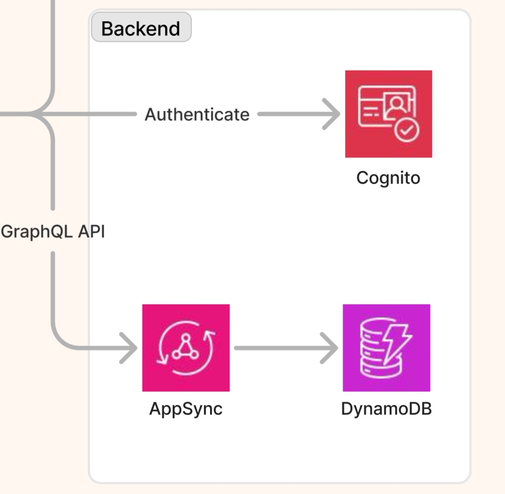

# Cubec 提案の件

## Links

[[2025-03-14]]
[[2025-03-16]]

## メール

```
沖様

先日はご面談ありがとうございました。
是非、次の最終ステップに進んでいただきたく、ご連絡いたしました。
よろしければ下記進め方でお願いできますでしょうか。

お願いしたいこと・今後の進め方
①プロジェクト詳細についての動画・資料をご確認いただき、ざっくりとした進め方とお見積りをご提示いただく。
・具体的には、「どのような関わり方が可能か」「どの範囲を支援できるか」といった概要レベルで構いません。
・コンペのような詳細な提案書の作成は不要です。
②その後、社内エンジニア・プロダクトマネージャーとの30分程度のディスカッションをお願いしたいと考えています。
③弊社検討後、お願いするかどうか決定させていただきたいとおもっています。

プロジェクト詳細は下記URLに格納しております。
https://drive.google.com/drive/folders/1_J2CeMtId60orz7f9FxkKYITjw-8vjD8?usp=drive_link
約7minの動画ファイルをご確認いただき、必要に応じて他の資料もご覧ください。
このプロジェクトでは、改良を繰り返しながら、9月に正式版リリースを目指しています。開発の進め方や技術選定についても柔軟に見直しながら進めていきたいと考えています。
期待する役割は下記ですが、最適な役割・進め方をご提案いただきディスカッションさせていただきたいと考えています。
・開発体制・プロセスの最適化
・技術選定
・全体設計
コンポーネントレベルの設計や運用は基本的に社内メンバーで担う想定ですが、ご意見をいただきながら柔軟に調整したいと考えています。

予算について
最大月30万円を想定していますが、効率よく進めることを重視しており、具体的な進め方に応じて調整できればと考えています。

いかがでしょうか。
```

## 理解やメモ

資料 動画4つ
https://drive.google.com/drive/folders/1_J2CeMtId60orz7f9FxkKYITjw-8vjD8

- 臨床疑問に対して、複数のリソースから情報収集を行い、比較検討している。しかし、聞く相手がいなかったりして諦める。この情報提供がプロダクトのコアな価値
- 

- DynamoDBで toB向けには耐えられなさそう。やはり RDB を使った方がいいか。
- フロントエンドが直接 LLMに問い合わせをしている。ビジネスロジックがフロントエンドにも漏れ出るのでスケールさせにくそう。どう責務を設計するか
- 変えにくい点を最初にしっかり設計したい。言語やDB、ついでインフラ。
- 医療情報は法律などで厳格に扱い方が決まっていたりする。暗号化等の項目がそれを表しているのか。

## 疑問

### 全体的に

- [ ] 今クローズド1？2？
- [ ] ロードマップの各フェーズの締切感はどれくらい強いか？
- [ ] 利用シーンは診察時？それ以外？
- [ ] 現在想定する理想のUXは？
- [ ] 開発メンバーのスキル感 → おそらくジュニア〜ミドル
- [ ] デザイナーはいる？デザインシステムはある？

### 技術的に

- [x] Amplifyって Cloud Runとどう違う？
- [x] GraphQLとアップシンクって何ぞ？どのように組み合わせてる？


## 議論の要点整理

###「どのような関わり方が可能か」「どの範囲を支援できるか」

- 基本的に月40時間の稼働が目安
- 定期ミーティングはリモートで週に2〜3回。スポットでその日の状況によりけり

1. ディレクション、全体設計
	- 前提: 私以外に技術選定や設計のできる人がいない
	- 内容: 開発体制、技術選定、全体設計を行う
		- 要件を整理する。それに合うアーキテクチャを決める
		- 個別技術選定はある程度叩き台のアイデアを出しメンバーと共に決める
		- 開発体制、コミュニケーション設計などを整理
		- コーディングは叩き台作成や簡易的なレビューまで？
2. 個別領域でのリード的振る舞い、実装者
	- 前提: 私以外にメインで技術選定や設計する人がいる
	- 内容: サーバーサイド側でのリードエンジニア
		- 要件や設計思想を汲み、実装を進める
		- メンバーのコードレビューや指導をする。

## 当日の議論内容

・開発体制・プロセスの最適化
・技術選定
・全体設計