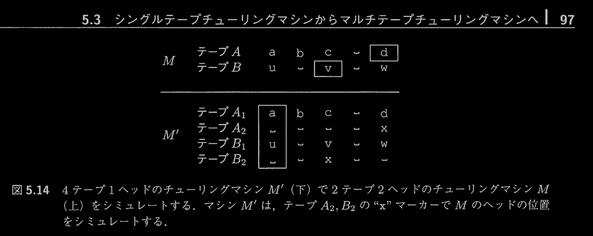

# 計算できるもの、計算できないもの

## 4.4 問題を「解く」ことの形式的な定義

判定問題

```
判定問題とは出力が bool の関数と理解していい
```


P(I) ∈ F(I)

```
入力（I）に対して
	•	その正しい解答の集合（F(I)）がある
	•	プログラム（P）が入力 I を受け取って出力したもの（P(I)）がその正解集合に含まれていれば、問題を解いているとみなす、
っていうふうに考えているわけだね
```

## 4.5 言語の認識と判定

LD = {I | D(I) = ″yes″}

```
入力Iが定義され、判定問題DにIを入力させて yesの出力を得られるもの全て（集合）をその言語であるとしている。
```

# 5.1 チューリングマシン

受理機とは boolが出力の関数と考えていいか？

```
基本的には「入力を与えたら受理（true）か拒否（false）のどちらかを出す機械」と思ってOK
だが、受理機（recognizer）は「言語に含まれる入力なら受理して停止するが、含まれない入力については必ずしも停止するとは限らない」という点があるんだ。つまり無限ループに入る可能性がある。
```

チューリング完全をプログラミング言語の具体的概念で説明

```
変数やメモリ：
→ チューリングマシンの無限テープに相当するのが、プログラム内で使う変数や配列、ヒープ領域など。これらにデータを保存できれば、計算の途中結果などを記憶できるよね。

制御構造（if, while, for, recursion）：
→ チューリングマシンでいうところの「状態遷移」にあたる部分。たとえば、if文やswitch文で条件に応じた処理を分岐させたり、whileループや再帰呼び出しで同じ処理を繰り返すことで、状況に応じた動作を実現するんだ。

関数やモジュール：
→ より大きな構造として、複雑な状態の管理や処理の分割を行うことで、チューリングマシンの動作（たとえば「特定の記号を見つけたら左に移動して書き換える」といった細かい操作）をプログラム上で表現できるようになる
```

##  5.3.4テープ2ヘッドチューリングマシン


```
マルチテープ・マルチヘッドのチューリングマシンも、「テープ内容とヘッド位置をうまく1本にエンコードすれば」 シングルテープマシンでシミュレート可能。
```

