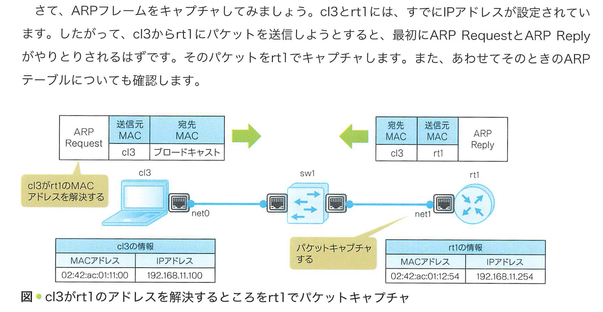
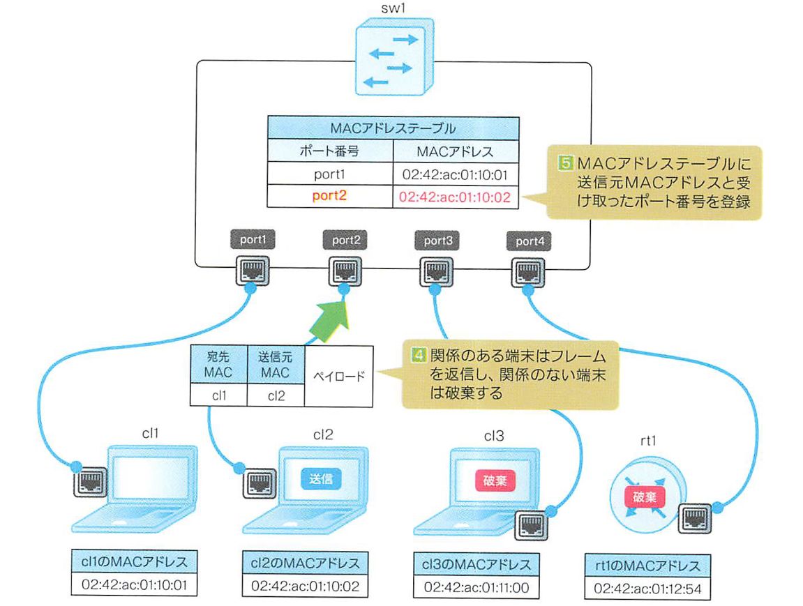

# 体験しながら学ぶネットワーク技術入門

## 【問題】キャプチャできない

20250222

- パケットキャプチャ試行したがエラー？だが、ファイルは作成されている。
- しかし、ping したあとに Wireshark で開いても、パケットがキャプチャされていないっぽい？

### 解決策

https://qiita.com/riv_infra/items/945478c49714dee44329

```
tcpdumpコマンドでpcapファイルの吐き出し先を変更し、吐き出した後/tmp/tinetにコピーしました。

root@cl2:/# tcpdump -i net0 -w /tmp/ethernet.pcap ether host 02:42:ac:01:10:01
tcpdump: listening on net0, link-type EN10MB (Ethernet), capture size 262144 bytes
^C4 packets captured
4 packets received by filter
0 packets dropped by kernel
root@cl2:/# cp /tmp/ethernet.pcap /tmp/tinet/

ローカル端末の~/tinetディレクトリは、multipass上のubuntuにあるディレクトリ/tmp/tinet/へマウントされているので、これによりローカル端末でWireSharkを起動し、対象のpcapファイルを選択することでパケット解析ができました。
```

## ARP



- 問い合わせ: 送信側が、目的のIPのMACアドレスが分からないときに、ネットワーク全体に「誰がこのIPのMAC持ってる？」とブロードキャストで問い合わせる。(画像1行目)
- 応答: 対象のIPを持つホストが、自分のMACアドレスを返答する。(画像2行目)
- 相互確認: この例では、双方のホストが互いにMACアドレスを確認し合って、通信できる状態になっている。(画像3行目)


## L2 スイッチング

cl1 から cl2 に ping
sw1(L2スイッチ)MACアドレステーブルになければ `フラッディング` してネットワーク内全体に確認メッセージを送信する



L2スイッチの情報

```
root@sw1:/# ovs-appctl fdb/show sw1
 port  VLAN  MAC                Age
    1     0  02:42:ac:01:10:01   90
    2     0  02:42:ac:01:10:02   90
```
