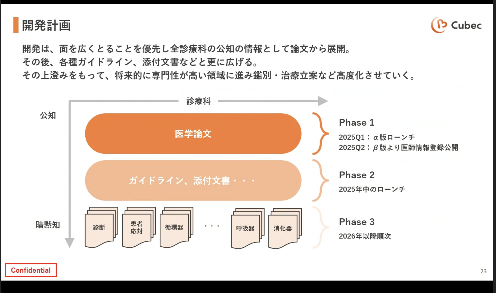
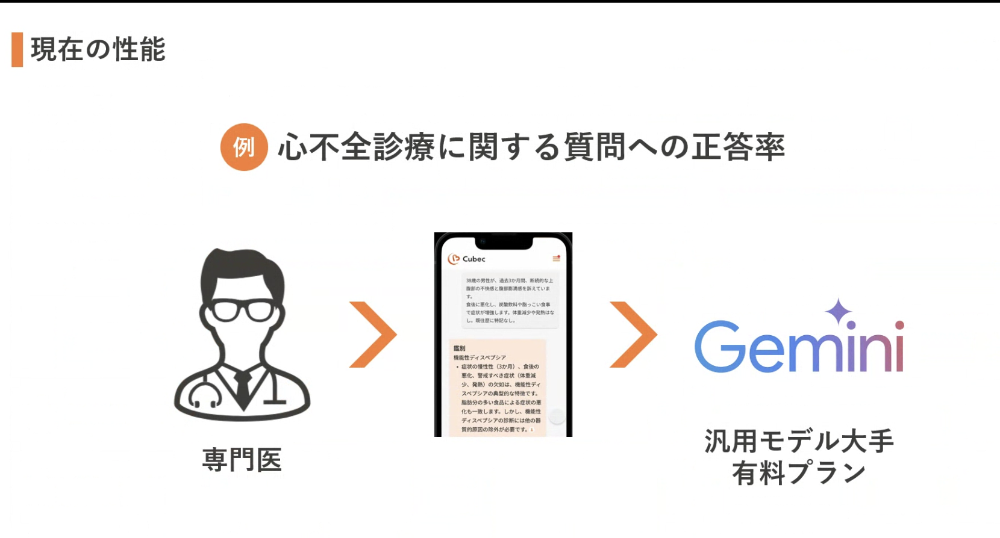
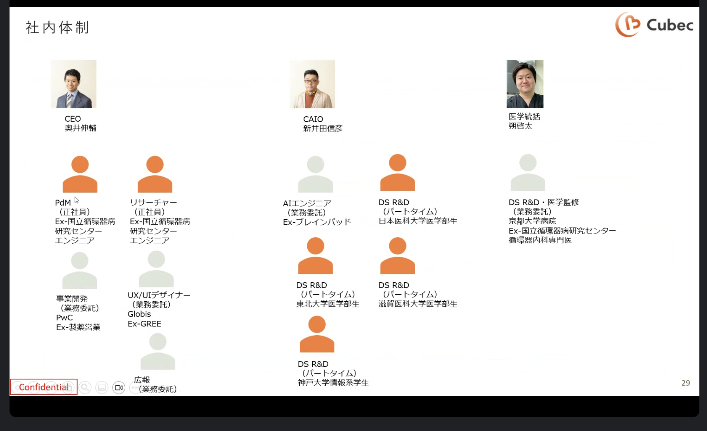
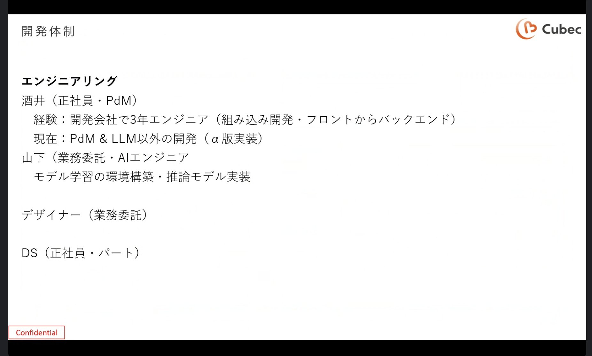

# Cubec ミーティング

## Links

- [[2025-03-10]]

## 1回目

- 医者、診療
  - かかりつけ医の守備範囲を広ひろげる？
  - 海外事例は？-> 似たコンセプトのサービスはある ClassAI ？
  - 例えば耳鼻科行ってますが。。。 -> 診断の幅が広がる、重大な病気の予兆など
  - カルテ -> まずは独立してつくる
- 競合は？->
- 仕組み？
  - LLM のファインチューニング？✅
  - 論文とかのRAG? + 暗黙知 -> 暗黙知は医師に直接聞く
  - 医師の判断などでフィードバックループを回すみたいな？
- すでに PoC みたいなものはある？
- 医師には無料提供 する。広告で稼ぐらしい。

### 資料画像

https://drive.google.com/file/d/1X2xCmkdOO2fIDxEBI9j6XgY3yBeSd2KC/view?usp=sharing

## 2回目

### 自己紹介

- 新田さん

### 質問

- まず数ヶ月で実現したいこと
	- アルファ版 -> エージェントなし
	- 第1段階 GW前後: にファーストリリース。エージェントあり版。アカデミックフォーカス版
	- 第2段階 9月: クリニカルシーン対応。実際の症例ベース(Web のスクレイピング、先生に実際に文章化してもらう)
- 技術的制約、決まっていることあるか？
	- データサイエンスチーム 8名、5名インターン Python
	- モデル, 講義モデルは汎用ビックテックのもの使っている
	- AWS -> 医療系データを置いている。エージェント的に、AOS？
		- RAGより大きい 
	- ブラウザログイン -> チャットUI

