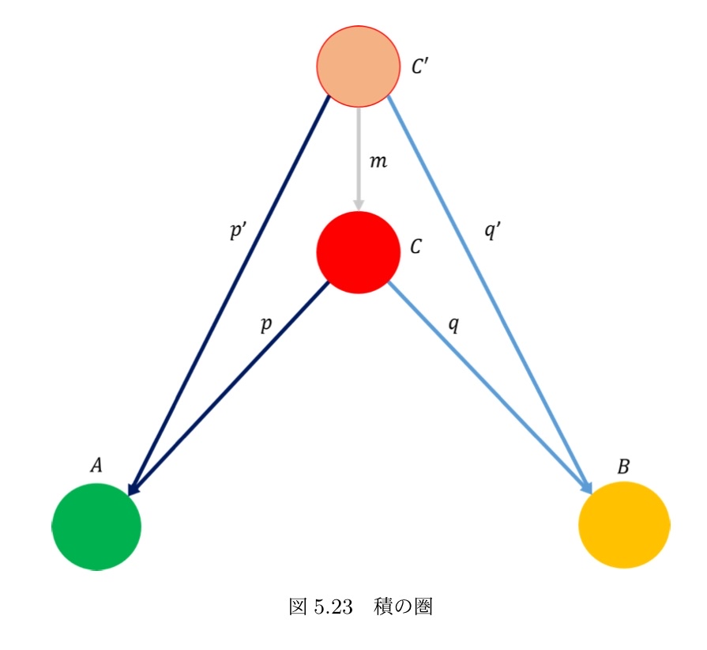
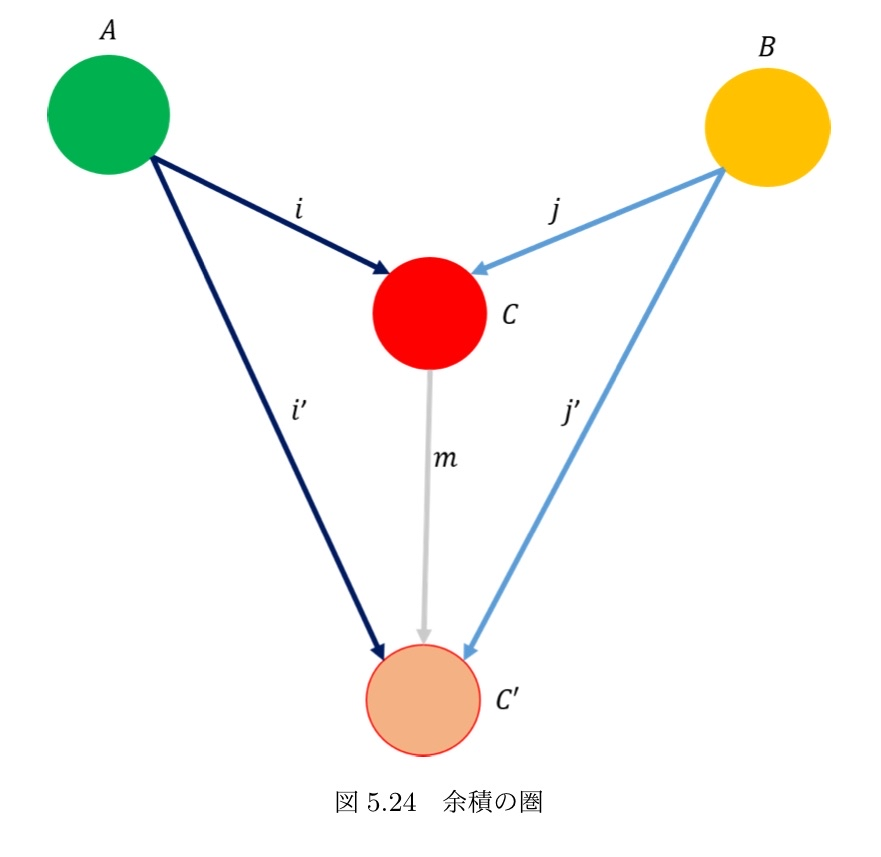

# プログラマーのための圏論

## Meta

[[圏論アイデア]]
#learning #category 

## 定義

一つのドメインから複数のコドメインへの射はあり得ない。圏でも関数でもない

※ Haskellメモ
- アプリカティブ → 並列 
- モナド → 継続

## 圏論を勉強しての発見

「数学的に同じ構造でも、モデル化する対象によって、圏論的・哲学的な性質が変わる」

## 単射と全射

集合の理論
ドメイン、コドメインで重複がないのが単射。コドメインの全てを網羅しておるのが全射

## モノ射とエピ射

全射単射の圏論バージョン
圏論では対象の中身を論じられないので、射の性質によって論じる

- モノ射: 単射の圏論バージョン **「左キャンセル可能」**
	- 「過去を区別可能」「左簡約できない」
	- 射 f: A → B がモノ射とは、どんな g1, g2: X → A に対して f ∘ g1 = f ∘ g2 なら g1 = g2 が成り立つこと
	- 
- エピ射: 全射の圏論バージョン **「右キャンセル可能」**
	- 「未来を制御できる」「右簡約できない」
	- 射 f: A → B がエピ射とは、どんな h1, h2: B → Y に対して h1 ∘ f = h2 ∘ f なら h1 = h2 が成り立つこと

圏論の概念は具体的な圏で検証した方がいいかもしれない

## 始対象 終対象

- 始対象
	- 1) f : A → B なる射が存在する。
	- 2) 任意の二つの射 f, g : A → B が存在するとき、f = g が成り立つ。「任意の対象」に対して「ただ一つの射」が存在する
	- 全ての始まりのイメージ。関数なら Void を引数に取る
- 終対象
	- 1) f : B → A なる射が存在する。
	- 1. 2) 任意の二つの射 f, g : B → A が存在するとき、f = g が成り立つ。「任意の対象」に対して「ただ一つの射」が存在する
	- 全ての終わりのイメージ。関数なら シングルトンを出力する

## 順序

- 前順序
	- 反射律と推移律を満たす
	- ループはありうる
	- じゃんけんやスポーツ選手の強さ比較など
- 半順序 
	- 反対象律を満たす
	- 2つの要素の間には高々一つの関係しかない
	- 家系図や周濠の大小関係
- 全順序
	- 全順序律を満たす
	-  2つの要素で必ず大小（もしくは同じ）を求めることができる
	- 自然数の比較。建物の階の比較

## 積 余積

積 最大公約数 デカルト積（直積） Haskellのタプル

余積 最小公倍数 直和 HaskellのEither

