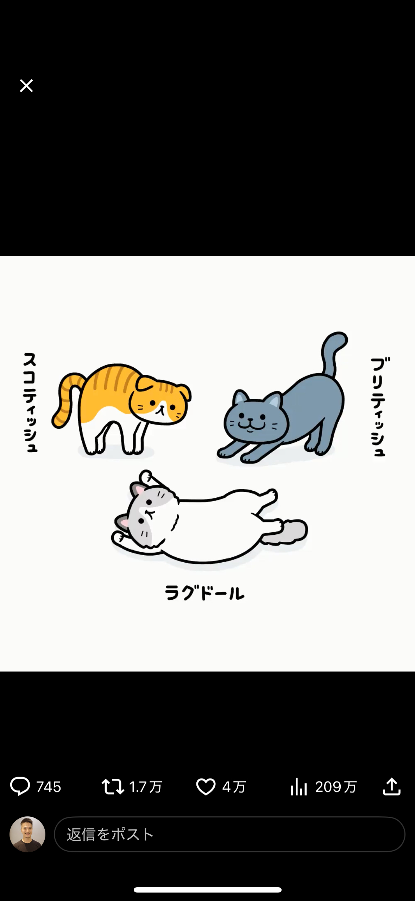
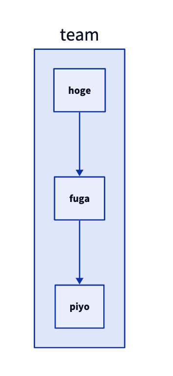

# Project1

## どのように表示されるな？

- 現状
  - MindNode
    - メリット
      - 直感的
      - スピーディな操作
      - 思考は整理できる Thinking!
    - デメリット
      - 文章として体系的にまとめにくい。
      - AI支援が使えない
      - 知識が積み重ねられない
- 気持ち
  - 「一歩足りない」
- 求めるもの
  - もっと自分のアイデアを整理して統合的に考えたい
  - 仕事
    - アイデアを積み重ねたい
  - 勉強
    - 知識をまとめたい
    - 新たな発見をしたい。
      - 発見したものを記録して次のアイデアに繋げたい
    - ノートテイキング

## モバイルから画像は？

あとから画像追加

#tes

[別プロジェクト](/Users/kazuhideoki/network-learning/memo.md)

⭐️ Private
- zed
  - ポートフォワード バージョン175で
- オンラインでお話し前に相手調査
  - 医療系のとこ
  - みやっち旅行系のとこ
